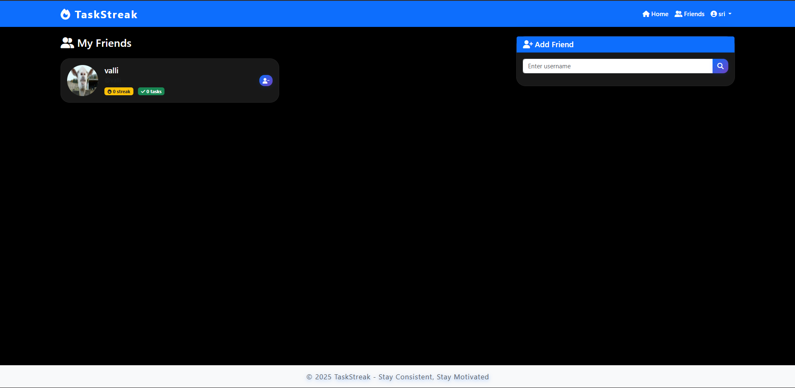
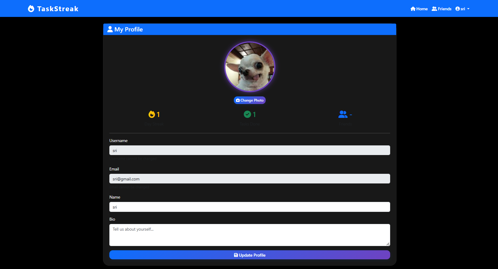

# TaskStreak- Your Daily Dose of Challenge and Consistency

TaskStreak is a Gen Z–friendly productivity web app that helps you build a daily habit of completing fun and challenging tasks. Track your streaks, stay consistent, and share your progress with friends through interactive stories — just like Instagram!

TaskStreak makes self-improvement social and competitive. By turning everyday challenges into a shared experience, it boosts your productivity, helps you beat laziness, encourages habit-building, and even brings friends closer together through healthy competition and mutual motivation.

---

## Features

- 📝 **Daily Tasks:** Get a new task every day and mark it as complete.
- 🔥 **Streak Tracking:** See your current streak and total tasks completed.
- 📸 **Stories:** Post a story (with image and caption) after completing a task. Stories expire after 24 hours.
- 👥 **Friends:** Add friends, accept/reject requests, and view their streaks and stories.
- 💬 **Comments:** Comment on friends’ stories.
- 🖼️ **Profile:** Update your profile photo, bio, and view your stats.
- 🗑️ **Delete Story:** Delete your own stories anytime.

---

## Screenshots

### Login Page
<p align="center">
  
</p>

### Sign in Page
<p align="center">
  
</p>

### Home Page
<p align="center">
  
</p>

### Today's Task Card
<p align="center">
  
</p>

### Stories Section
<p align="center">
  
</p>

### Friends Page
<p align="center">
  
</p>

### Profile Page
<p align="center">
  
</p>

---

## Demo Steps

1. **Sign Up / Login**
    - Go to `/signup` to create a new account.
    - Login at `/login`.

2. **Complete Today's Task**
    - View your daily task on the home page.
    - Click **Complete Task** when done.

3. **Add a Story**
    - After completing a task, click **Add to Story**.
    - Upload an image and add a caption.

4. **View Stories**
    - See your stories and friends’ stories in the Stories section.
    - Click a story to view details and comments.

5. **Comment on Stories**
    - Add comments to any story.

6. **Manage Friends**
    - Search for users, send friend requests, accept/reject requests.
    - Remove friends if needed.

7. **Profile**
    - Update your profile photo and bio from the Profile page.

8. **Delete Your Story**
    - Click the **Delete** button on your own story to remove it.

---

## Tech Stack

- **Backend:** Flask, SQLite
- **Frontend:** Bootstrap 5, jQuery, Font Awesome
- **Other:** Lordicon (animated icons), custom SVGs

---

## Setup Instructions

1. **Clone the repo:**
    ```bash
    git clone https://github.com/yourusername/taskstreak.git
    cd taskstreak
    ```

2. **Install dependencies:**
    ```bash
    pip install flask werkzeug
    ```

3. **Run the app:**
    ```bash
    python app.py
    ```

4. **Open in browser:**
    ```
    http://localhost:5000
    ```

---

## Folder Structure

```
taskstreak/
├── app.py
├── database.py
├── tasks.py
├── static/
│   ├── css/
│   ├── js/
│   └── uploads/
├── templates/
│   ├── base.html
│   ├── home.html
│   ├── login.html
│   ├── signup.html
│   ├── profile.html
│   └── friends.html
└── screenshots/
```

---

## Contributing

Pull requests are welcome hehehe 

---
